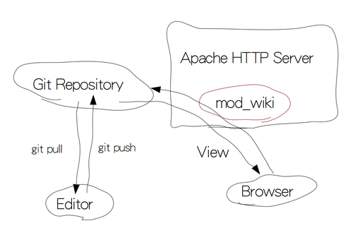

mod_wiki
========

## I think it's the best wiki system

mod_wiki is git based wiki system for Apache HTTPD Server.

## Source Code

https://github.com/hamano/apache-mod-wiki

## Build

    % ./configure --with-apache=<APACHE_DIR> \
        --with-discount=<DISCOUNT_BUILD_DIR> \
        --with-libgit2=<LIBGIT2_DIR>
    % make
    # make install

### Dependencies

* discount
    - http://www.pell.portland.or.us/~orc/Code/discount/
* libgit2
    - http://libgit2.github.com/

## Configration

httpd.conf

    LoadModule wiki_module modules/mod_wiki.so
    <Location />
      SetHandler wiki
      WikiRepository /path/to/repository.git
      WikiName "My Wiki"
      WikiCss /style.css
    </Location>

## Usage

### Search

`grep <KEYWORD> *.md`

or `git clone` and `git grep <KEYWORD>`

or google search

### History
`git log`

## Author
Tsukasa Hamano <http://twitter.com/hamano>
